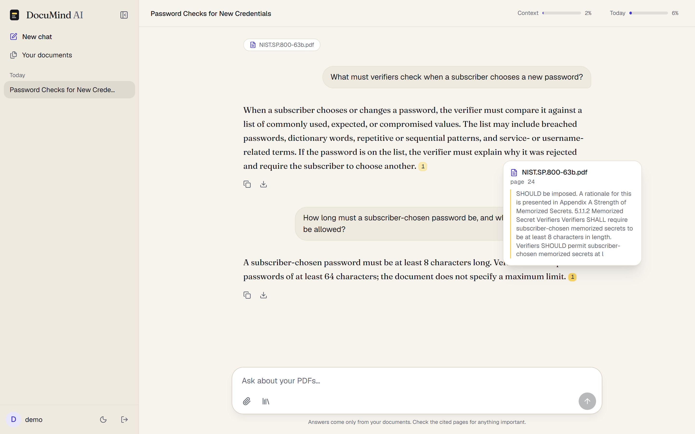
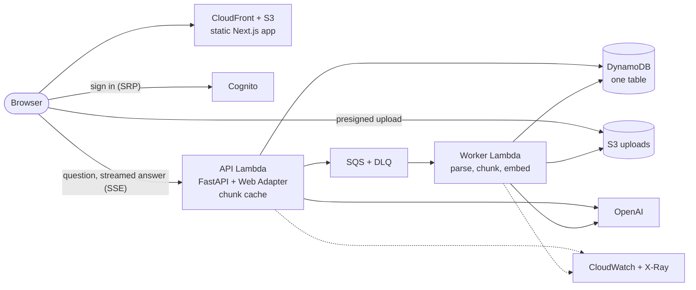
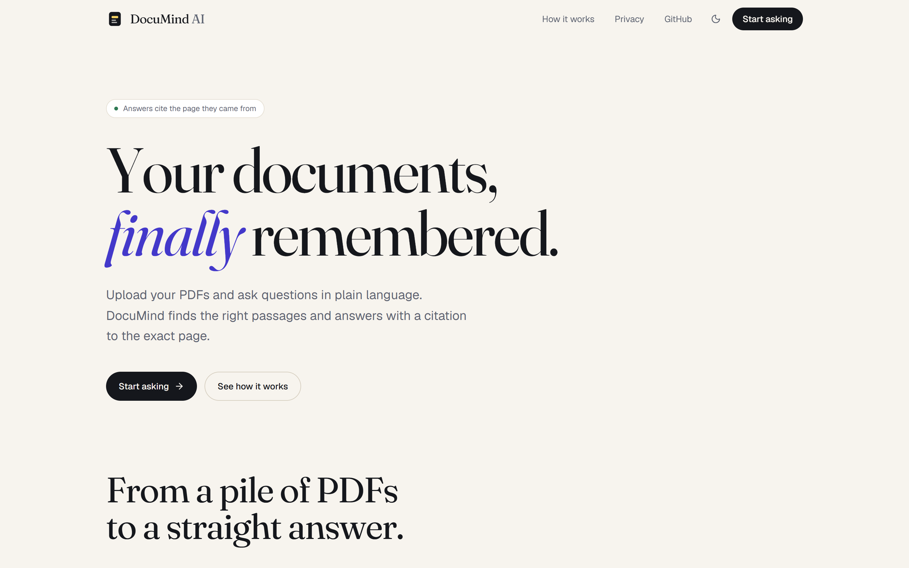

# DocuMind AI
**Ask questions about your PDFs. Every answer cites the page it came from.**

[](https://github.com/BharathK05/DocuMindAI/actions/workflows/ci.yml)
[](https://github.com/BharathK05/DocuMindAI/actions/workflows/deploy.yml)

**Live:** https://d19nhg39ihjlzg.cloudfront.net

A production-style retrieval-augmented generation (RAG) system on the **AWS free tier ($0 a month)**:
- **Web app:** a static Next.js site.
- **API:** a streaming FastAPI app on Lambda.
- **Ingestion:** a queue-driven worker.
- **Everything else:** Terraform infrastructure deployed by GitHub Actions through OIDC, with an evaluation harness, load tests, tracing and alarms.

<picture>
  <source media="(prefers-color-scheme: dark)" srcset="docs/images/chat-dark.png">
  
</picture>

## At a glance
| | |
|---|---|
| **Answer quality** (55-question golden set, [evaluation.md](docs/evaluation.md)) | Recall@5 **0.98**, correctness **0.96** (baseline 0.78), faithfulness **1.00**, declines 100% of unanswerable questions |
| **Speed on AWS** ([performance.md](docs/performance.md)) | First words in **3.0 s** median. The largest remaining cost is an LLM reranking step, found by tracing |
| **Bottleneck found and fixed** | DynamoDB reads per question **84 → 0.5** (in-Lambda chunk cache); the free tier's limit went from ~0.18 to ~30 questions a second |
| **Cost** | AWS **$0** (always-free services only); OpenAI ~$0.0006 per question, bounded by per-user quotas, a service-wide daily cap and a spend alarm |
| **Quality gates** | Backend tests with a 90% coverage gate, strict mypy, frontend tests, Lighthouse 90+, Terraform validation and linting, secret and dependency scans |

## Architecture

Upload and question flows, the data model and the code layout are in **[docs/architecture.md](docs/architecture.md)**.

**How a question is answered:**
1. Check the rate limit and quotas.
2. Embed the question.
3. **Hybrid search:** vector search plus BM25, merged with reciprocal rank fusion, over the chosen PDFs' chunks.
4. An **LLM reranker** orders the top 20.
5. The best 5 chunks, within a 3k-token budget, go to the model as untrusted `<source>` data.
6. The answer **streams** back, with `[n]` markers that the UI shows as citation chips.
7. After the first answer, the chat names itself.

**How a PDF is ingested:**
1. The browser uploads straight to S3.
2. An SQS job hands it to the worker, which:
   - parses the pages;
   - strips headers, footers and table-of-contents lines;
   - cuts ~350-token "Title > Section" chunks;
   - embeds them;
   - stores the chunks with float16 vectors in DynamoDB.
3. The PDF is deleted.

## Key design decisions
| Decision | Why | ADR |
|---|---|---|
| Exact vector search inside Lambda, chunks in DynamoDB | $0, exact recall and isolation by partition; fine for thousands of chunks per user | [1](docs/adr/0001-vector-search-in-lambda-on-dynamodb.md) |
| Lambda + Function URLs + Lambda Web Adapter | No idle cost and native streaming; the cost is 2–3 s cold starts | [2](docs/adr/0002-serverless-lambda-function-urls.md) |
| SQS between upload and ingestion | Retries, a DLQ and back-pressure for free | [3](docs/adr/0003-sqs-for-ingestion.md) |
| Structured chunks + hybrid search + LLM rerank | Each step measured: correctness 0.78 → 0.96 | [4](docs/adr/0004-chunking-and-retrieval-pipeline.md) |
| Designing for $0 | Always-free services, provisioned DynamoDB, bounded fan-out, spend caps | [5](docs/adr/0005-designing-for-zero-dollars.md) |
| LLM provider interface | Models and prices from config; offline fake provider | [6](docs/adr/0006-llm-provider-interface.md) |
| OpenTelemetry → X-Ray | The X-Ray SDK reaches end of support in 2027; the OpenTelemetry Lambda layer conflicts with the Web Adapter | [7](docs/adr/0007-opentelemetry-with-xray-exporter.md) |
| Static web app on CloudFront | One build for every environment, via a runtime `config.json` | [8](docs/adr/0008-static-web-app-on-cloudfront.md) |
| Server-side chats, context budget, quotas | Chat history can't be forged; bounded prompt size; honest `429`s | [9](docs/adr/0009-server-side-conversations-and-quotas.md) |

**What breaks at 10× and 100× load,** and what to pay for at each stage: [docs/scaling.md](docs/scaling.md).

## Run locally
**Prerequisites:** Python 3.13+, Node 22+, Docker.

```bash
cp backend/.env.example backend/.env   # add OPENAI_API_KEY, or set DOCUMIND_LLM_PROVIDER=fake
docker compose up --build              # API → http://localhost:8000/docs
cd frontend && npm install && npm run dev   # web app → http://localhost:3000
```

Mint a development token and paste it at `/login`, or into **Authorize** at `/docs`:
```bash
cd backend && python -m documind.scripts.dev_token --user alice
```
- **Separate accounts.** Each `--user` is a separate, isolated account.
- **Cost.** The stack runs DynamoDB Local and [moto](https://github.com/getmoto/moto) (S3 + SQS), so local development costs nothing and needs no AWS account.

**Without Docker** (in-memory storage; the browser can't upload files this way):
```bash
python -m venv .venv && .venv/Scripts/activate      # macOS/Linux: source .venv/bin/activate
pip install -e "backend[server,dev,demo]"
cd backend && uvicorn documind.api.main:app --reload
```

## Deploy
[infra/README.md](infra/README.md) covers the one-time bootstrap: the state bucket, the GitHub OIDC roles and the budgets. After that:
- **Pull request:** a `terraform plan` for dev and prod is posted on it.
- **Merge:** dev is applied, smoke-tested, and gets the web app published. Prod waits for a reviewer's approval.

## API
Every endpoint except `/health` needs `Authorization: Bearer <token>`: a Cognito access token on AWS, or a dev token locally. The interactive docs are at `/docs`.

| Method | Path | Purpose |
|---|---|---|
| `POST` | `/v1/documents` | Register a PDF and get a presigned S3 upload form |
| `POST` | `/v1/documents/{id}/complete` | Confirm the upload and queue ingestion |
| `GET` | `/v1/documents` · `/v1/documents/{id}` | List documents · check ingestion status |
| `DELETE` | `/v1/documents/{id}` | Delete a document and its chunks |
| `POST` | `/v1/conversations` | Start a chat, optionally with attached PDFs |
| `GET` | `/v1/conversations` · `/v1/conversations/{id}` | List chats · read one, with messages and citations |
| `PATCH` · `DELETE` | `/v1/conversations/{id}` | Rename · delete a chat |
| `POST` | `/v1/query` | Answer with citations, plus token usage, context and quota figures |
| `POST` | `/v1/query/stream` | Same, as Server-Sent Events: `sources` → `token`… → `done`, then `title` on a chat's first answer |
| `GET` | `/v1/usage?conversation_id=` | Figures for the context-window and daily-quota bars |

To try the whole flow from the terminal: `python backend/scripts/try_api.py some.pdf "Your question?"`.

## Security and cost controls
- **Tenant isolation.** The token's `sub` is the user id. Every user-owned DynamoDB key starts with `USER#<id>`, and the chunk cache is keyed by user.
- **Authentication.**
  - Cognito sign-in uses SRP, so passwords never leave the browser.
  - The API verifies RS256 access tokens against the pool's public keys, checking issuer, `token_use` and client.
- **Limits.**
  - **Per user:** 20 questions a minute, 20 uploads an hour, and a daily token quota.
  - **Service-wide:** a daily token cap for all users together.
  - All return `429` with `Retry-After`.
- **Prompt-injection defenses.**
  - Document text is fenced as untrusted data, and tag-like text inside it is neutralized.
  - Clients can't send system messages; chat history comes from the server.
  - Summaries of old turns get the assistant role, never system.
- **Data handling.**
  - PDFs are deleted after indexing, and the upload bucket expires leftovers after a day.
  - S3 and DynamoDB are encrypted at rest, and everything is HTTPS-only.
  - The site sends a CSP, HSTS and `frame-ancestors 'none'`.
- **Secrets.**
  - The OpenAI key is an SSM SecureString, deliberately not managed by Terraform, so it never lands in state.
  - GitHub deploys through OIDC roles, with no stored AWS keys.
- **Scans.** gitleaks (full history), pip-audit, npm audit and Dependabot.

## Tests and CI
```bash
cd backend && pytest --cov && ruff check . && mypy src evals tests scripts
cd frontend && npm run lint && npm run typecheck && npm test && npm run build
```
Tests need no OpenAI key or AWS account: a deterministic fake provider stands in for OpenAI, and moto stands in for AWS.

[`ci.yml`](.github/workflows/ci.yml) runs on every pull request:
1. **Lint and type-check:** ruff, and mypy in strict mode.
2. **Tests:** pytest with a 90% coverage gate.
3. **Terraform:** fmt, validate and tflint.
4. **Security:** gitleaks and pip-audit.
5. **Web app:**
   - ESLint, Prettier and tsc;
   - Vitest;
   - the static build;
   - a check that the landing page's eval numbers match the results file;
   - npm audit;
   - Lighthouse (performance and accessibility 90+).
6. **Lambda packages:**
   - a reproducible arm64/x86 build;
   - a smoke test inside AWS's Lambda Python image with the network off.

[`deploy.yml`](.github/workflows/deploy.yml) plans on pull requests and applies on merge.

Evaluation and load tests are run on demand: see [backend/evals/](backend/evals/) and [backend/loadtest/](backend/loadtest/).

## Repository layout
```
backend/     FastAPI app, ingestion worker, eval harness (evals/), load tests (loadtest/)
frontend/    Next.js web app (landing page + chat)
infra/       Terraform: account bootstrap, modules, dev and prod environments
docs/        architecture, ADRs, evaluation, performance, scaling, original spec
```

<details>
<summary>Landing page</summary>


</details>
