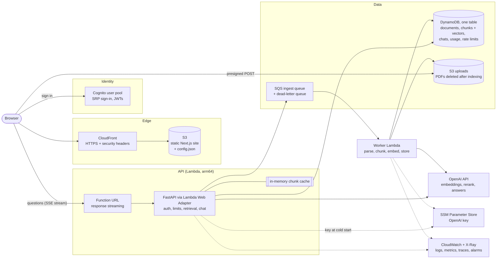
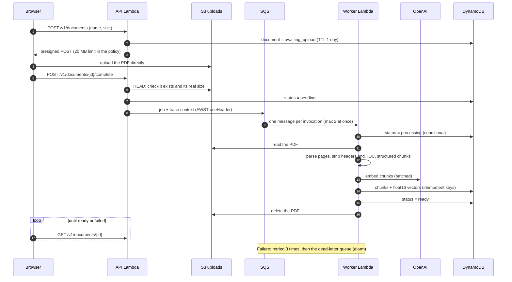
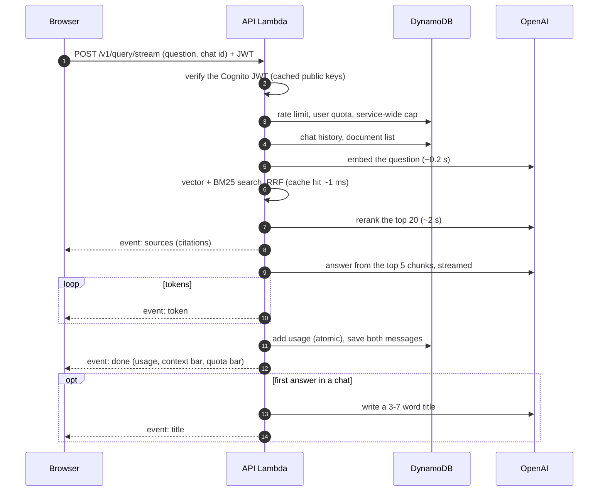

# Architecture

**Components:**
- a static web app;
- a streaming API on Lambda;
- an ingestion worker behind a queue;
- one DynamoDB table.

Everything is in Terraform ([`infra/`](../infra/)) and deployed by GitHub Actions through OIDC. Each choice is explained in the [ADRs](adr/).

## System

## Upload and ingestion

## Asking a question

## Data model (one DynamoDB table)
Every user-owned item is under the user's partition, so isolation is structural: no repository method can read without a user id.

| Item | PK | SK | Notes |
|---|---|---|---|
| Document | `USER#<id>` | `DOC#<doc>` | Status, pages, chunks; `expires_at` while awaiting upload |
| Chunk | `USER#<id>` | `CHUNK#<doc>#<index:05d>` | Text, page, section context, float16 vector (~4.7 KB) |
| Conversation | `USER#<id>` | `CONV#<chat>` | Title, attached documents, message counter, running summary |
| Message | `USER#<id>` | `MSG#<chat>#<index:06d>` | Role, content, citations |
| Rate-limit window | `USER#<id>` | `RATE#<bucket>#<window>` | Fixed-window counter, TTL |
| Daily usage | `USER#<id>` | `USAGE#<YYYY-MM-DD>` | Tokens and requests; TTL after 35 days |
| Service-wide usage | `SERVICE` | `USAGE#<YYYY-MM-DD>` | All users together, for the global cap |

**Throughput:**
- **Capacity.** Provisioned: prod 15/15, dev 5/5, which fits the free 25/25.
- **Read costs per question:**
  - the document list and conversation queries are small;
  - reading a document's chunks costs ~0.5 units per 4 KB, e.g. 84 units for an 80-page PDF;
  - so the API caches decoded chunks per instance.

## Code layout ([`backend/src/documind/`](../backend/src/documind/))
| Package | Responsibility |
|---|---|
| `api/` | FastAPI app, routes, request/response schemas, error envelope, request middleware (request id, metrics, tracing) |
| `services/` | Use cases: document upload, ingestion, retrieval + answering (`query.py`), chat turns (`chat.py`), context management, reranking, titles, usage/quotas |
| `repositories/` | Storage behind small protocols (`base.py`): DynamoDB, S3, SQS, plus in-memory versions for tests |
| `providers/` | OpenAI and fake providers behind `EmbeddingProvider` / `LLMProvider` |
| `ingestion/` | PDF parsing, structure detection, chunking |
| `core/` | Settings, auth (Cognito/local JWT), the dependency container, logging, metrics, tracing, errors |

**Entry points:**
- `api/main.py`: the API;
- `lambda_worker.py`: the SQS-triggered worker;
- `worker.py`: a long-polling worker for docker-compose.
